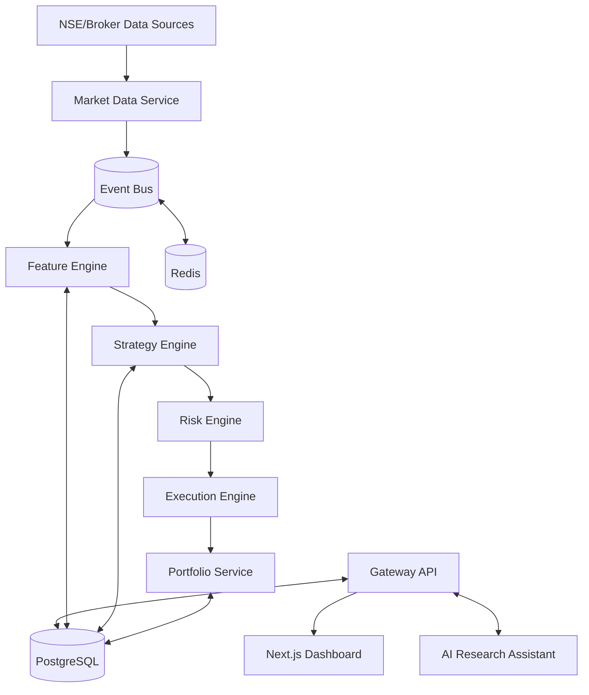

# SPEC-002 — High-Level System Architecture
Version: 1.0

> This specification defines the macro-architecture of QuantForge AI.
> It establishes service boundaries, communication patterns, deployment topology,
> technology constraints, and architectural decision records.

# 1. Architectural Goals

- Independent deployability
- Event-driven communication
- Deterministic quant research
- Low coupling / high cohesion
- Local-first development
- Production-ready modularity

# 2. Context Diagram

# 3. Bounded Contexts

## Market Data
Owns:
- instruments
- ticks
- candles
- sessions

Publishes:
- TickReceived
- CandleClosed

Consumes:
- Symbol subscriptions

## Research
Owns:
- indicators
- engineered features
- factor datasets

## Strategy
Owns:
- strategy definitions
- signals
- optimization jobs

## Portfolio
Owns:
- accounts
- positions
- PnL
- allocations

## Risk
Owns:
- exposure
- limits
- approvals

## Execution
Owns:
- orders
- executions
- broker adapters

## AI
Owns:
- reports
- explanations
- strategy generation

# 4. Service Contracts

Every service SHALL expose:
- REST API
- Internal service interface
- Event publisher
- Event consumer
- Health endpoint
- Metrics endpoint

# 5. Deployment Topology

Development:
- Next.js (Vercel/local)
- FastAPI (Render/local)
- PostgreSQL (Neon/local)
- Redis (Upstash/local)

Production:
- Docker containers
- Reverse proxy
- Horizontal scaling for stateless services

# 6. ADR-001

Decision:
Adopt a modular monorepo.

Reason:
Shared types, shared SDK, simplified CI.

Consequences:
Independent packages with shared tooling.

# 7. ADR-002

Decision:
Use event-driven workflows.

Reason:
Loose coupling, replayability, scalability.

# 8. Non-Functional Requirements

Latency:
- Dashboard updates <100 ms after internal propagation.

Availability:
- Automatic reconnect for data feeds.

Security:
- Zero secrets in repository.

Observability:
- Structured logging
- Metrics
- Trace IDs

# 9. Acceptance Criteria

- Every bounded context isolated.
- No cyclic dependencies.
- All inter-service communication documented.
- Architecture diagrams updated before implementation.

# 10. Claude Code Guidance

Implement services independently.
Do not bypass service boundaries.
Do not access another service's database directly.
Communicate only through APIs or documented events.
