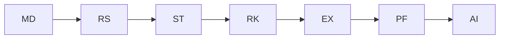

# SPEC-003 — Domain-Driven Design & Bounded Contexts
Version: 1.0

## Executive Summary
This specification defines the business domains, ownership boundaries, shared language,
integration rules, and implementation contracts for QuantForge AI.

---

# 1. Ubiquitous Language

| Term | Meaning | Owner |
|------|---------|-------|
| Instrument | Tradable asset | Market Data |
| Tick | Smallest market update | Market Data |
| Candle | Aggregated OHLCV | Market Data |
| Indicator | Derived feature | Research |
| Signal | Buy/Sell/Hold recommendation | Strategy |
| Position | Open market exposure | Portfolio |
| Order | Broker instruction | Execution |
| Fill | Executed order event | Execution |
| Exposure | Aggregate portfolio risk | Risk |

---

# 2. Bounded Contexts

## Market Data Context
Responsibilities:
- Instrument master
- Tick ingestion
- Candle generation
- Trading sessions
- Corporate actions metadata

Produces:
- TickReceived
- CandleClosed
- MarketOpened
- MarketClosed

Never:
- Computes trading signals
- Calculates risk

---

## Research Context

Responsibilities:
- Technical indicators
- Feature engineering
- Statistical datasets
- Feature store

Consumes:
- TickReceived
- CandleClosed

Produces:
- FeatureUpdated
- IndicatorCalculated

---

## Strategy Context

Responsibilities:
- Strategy SDK
- Signal generation
- Parameter optimization
- Alpha ranking

Produces:
- SignalGenerated

Consumes:
- FeatureUpdated

---

## Portfolio Context

Responsibilities:
- Cash
- Holdings
- PnL
- Allocation

Produces:
- PositionUpdated

---

## Risk Context

Responsibilities:
- Position sizing
- Limits
- Drawdown checks
- Exposure
- VaR

Produces:
- TradeApproved
- TradeRejected

---

## Execution Context

Responsibilities:
- OMS
- Broker adapters
- Retry logic
- Fill reconciliation

Produces:
- OrderSubmitted
- OrderFilled
- OrderRejected

---

## AI Context

Responsibilities:
- Natural language interface
- Explainability
- Report generation
- Strategy drafting

Never directly executes trades.

---

# 3. Context Map

---

# 4. Integration Rules

1. No context may directly modify another context's database.
2. Communication occurs only via:
   - REST APIs
   - WebSocket streams
   - Versioned domain events
3. Every event must be immutable.
4. Every event requires schema versioning.

---

# 5. Aggregate Roots

Market Data:
- Instrument

Research:
- FeatureSet

Strategy:
- StrategyDefinition

Portfolio:
- Portfolio

Risk:
- RiskPolicy

Execution:
- Order

AI:
- Conversation

---

# 6. Domain Events

Required metadata:

- event_id
- event_type
- schema_version
- correlation_id
- timestamp
- producer
- payload

---

# 7. Acceptance Criteria

- No cyclic dependencies.
- Context ownership documented.
- Domain events versioned.
- Shared language consistent across services.

---

# 8. Claude Code Guidance

Respect bounded contexts.
Do not duplicate business logic.
Extract reusable contracts into shared packages only when ownership is clearly defined.
