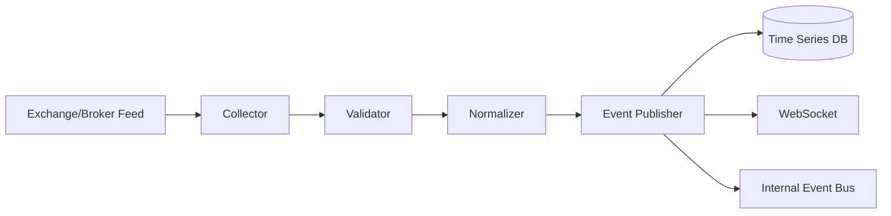

# SPEC-004 — Market Data Platform
Version: 1.0

## Executive Summary
The Market Data Platform is the foundation of QuantForge AI. Every downstream
service depends on accurate, timely and reproducible market data. This
specification defines the architecture, ownership boundaries, ingestion
pipeline, persistence strategy, APIs, events, operational constraints and
acceptance criteria.

---

# 1. Goals

- Real-time market ingestion
- Historical replay
- Deterministic candle generation
- Fault-tolerant streaming
- Low-latency event publication
- Vendor abstraction

---

# 2. Responsibilities

Owns:
- Instrument master
- Tick ingestion
- Candle aggregation
- Trading calendar
- Market session state

Never owns:
- Indicators
- Signals
- Orders
- Risk

---

# 3. High-Level Flow

---

# 4. Pipeline

1. Receive raw tick.
2. Validate timestamp, symbol and payload.
3. Normalize to canonical schema.
4. Persist immutable tick.
5. Update active candle.
6. Publish TickReceived.
7. Publish CandleClosed when interval completes.

---

# 5. Canonical Tick Model

Required fields:

- symbol
- exchange
- timestamp
- last_price
- volume
- bid
- ask
- open_interest (optional)
- source
- sequence_number

Ticks are immutable after persistence.

---

# 6. Candle Rules

Intervals:
- 1s
- 1m
- 5m
- 15m
- 1h
- 1d

Every candle stores:
- open
- high
- low
- close
- volume
- vwap
- trade_count

---

# 7. Database

Tables

market.instruments
market.ticks
market.candles_1m
market.candles_5m
market.candles_15m
market.candles_1h
market.candles_1d
market.sessions

Indexes:
(symbol,timestamp)
(exchange,symbol)

Retention:
Ticks may be archived.
Candles retained indefinitely.

---

# 8. Events

TickReceived
CandleUpdated
CandleClosed
MarketOpened
MarketClosed
FeedDisconnected
FeedRecovered

All events contain:
event_id
schema_version
correlation_id
timestamp
payload

---

# 9. Public APIs

GET /api/v1/instruments
GET /api/v1/candles
GET /api/v1/ticks
GET /api/v1/sessions

WebSockets:
- /ws/market
- /ws/candles

---

# 10. Reliability

Collector shall:
- Auto reconnect
- Exponential backoff
- Heartbeat detection
- Duplicate suppression

---

# 11. Performance

Targets:
- Tick persistence <20 ms
- Internal publish <10 ms
- Dashboard propagation <100 ms
- Zero data mutation after commit

---

# 12. Testing

Unit:
- Validation
- Normalization
- Candle builder

Integration:
- Replay historical feed
- Reconnect tests
- Duplicate detection

Load:
- Sustained tick ingestion
- Burst handling

---

# 13. Acceptance Criteria

- Deterministic candle generation
- Immutable tick storage
- Replay produces identical candles
- Events versioned
- APIs documented
- Tests passing

---

# 14. Claude Code Guidance

Implement this service before all others.
Never allow downstream services direct database writes.
Treat market data as the single source of truth.
