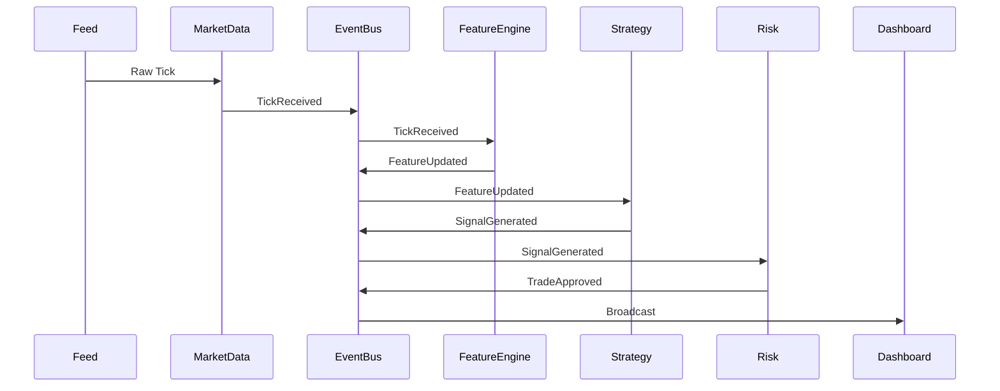

# SPEC-005 — Event Streaming & WebSocket Infrastructure
Version: 1.0

## Executive Summary

This specification defines how every component inside QuantForge AI communicates in
real time. The platform adopts an event-driven architecture where immutable domain
events are the primary integration mechanism between services.

---

# 1. Objectives

- Low-latency event propagation
- Loose coupling between services
- Replayable event history
- Versioned event contracts
- Reliable client streaming

---

# 2. Event Lifecycle

---

# 3. Event Envelope

Every event SHALL contain:

- event_id (UUID)
- event_type
- schema_version
- timestamp (UTC ISO-8601)
- producer
- correlation_id
- payload

Events are immutable once published.

---

# 4. Event Types

## Market Data
- TickReceived
- CandleUpdated
- CandleClosed
- MarketOpened
- MarketClosed

## Research
- FeatureCalculated
- IndicatorCalculated

## Strategy
- SignalGenerated
- StrategyStarted
- StrategyStopped

## Risk
- TradeApproved
- TradeRejected

## Execution
- OrderSubmitted
- OrderFilled
- OrderCancelled

---

# 5. WebSocket Channels

/ws/market
- ticks
- candles
- market status

/ws/signals
- live signals
- confidence
- explanation

/ws/portfolio
- positions
- pnl
- exposure

/ws/orders
- order status
- fills

/ws/system
- health
- notifications

---

# 6. Client Behaviour

Clients must:
- auto reconnect
- exponential backoff
- heartbeat every 30s
- resume subscriptions
- ignore duplicate events

---

# 7. Reliability

Requirements:

- At-least-once delivery internally
- Idempotent consumers
- Duplicate suppression
- Dead-letter queue for invalid events

---

# 8. Performance Targets

Internal publish latency:
<10 ms

Dashboard propagation:
<100 ms

Reconnect:
<5 seconds

---

# 9. Security

- JWT authentication
- Per-channel authorization
- Rate limiting
- Message size limits

---

# 10. Testing Matrix

Unit
- Event serialization
- Schema validation

Integration
- Multi-service propagation
- Replay

Load
- 1000+ events/sec
- Concurrent WebSocket clients

Chaos
- Network interruption
- Event duplication
- Delayed delivery

---

# 11. Acceptance Criteria

- Versioned schemas
- Replay produces identical ordering
- Clients recover after disconnect
- Duplicate events safely ignored

---

# 12. Claude Code Guidance

No service may communicate by directly invoking another service's internal
implementation. Shared behaviour must occur only through documented APIs or
versioned events.
