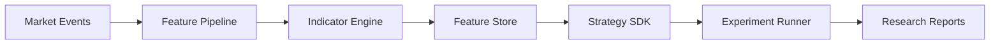

# SPEC-007 — Quantitative Research Engine
Version: 1.0

## Executive Summary

The Quantitative Research Engine transforms raw market data into research-ready
features, evaluates hypotheses, manages experiments, and produces reproducible
signals for downstream strategy evaluation.

---

# 1. Objectives

- Deterministic feature engineering
- Experiment reproducibility
- Pluggable indicator framework
- Alpha factor research
- Strategy benchmarking
- Experiment versioning

---

# 2. Responsibilities

Owns:
- Indicator calculations
- Feature engineering
- Feature Store
- Research experiments
- Parameter optimization
- Experiment reports

Never owns:
- Order execution
- Risk approvals
- Portfolio accounting

---

# 3. Processing Pipeline

---

# 4. Feature Categories

## Price
- OHLC
- Returns
- Log returns
- Gaps

## Volume
- Volume
- VWAP
- Volume profile
- Relative volume

## Trend
- SMA
- EMA
- MACD
- ADX

## Volatility
- ATR
- Historical volatility
- Parkinson estimator

## Momentum
- RSI
- ROC
- Stochastic oscillator

## Statistical
- Rolling mean
- Rolling variance
- Z-score
- Correlation
- Beta

---

# 5. Indicator Framework

Every indicator implements:

- initialize()
- update(event)
- value()
- reset()

Requirements:
- Stateless where possible
- Incremental updates
- Unit tested
- Pure computations

---

# 6. Feature Store

Stores:
- feature_id
- symbol
- timeframe
- timestamp
- feature_name
- value
- metadata

Policies:
- Immutable records
- Versioned schemas
- Time-based queries

---

# 7. Experiment Tracking

Each experiment records:
- dataset version
- strategy version
- feature set
- parameters
- random seed
- execution time
- metrics
- artifacts

Experiments are reproducible by identifier.

---

# 8. Optimization

Supported:
- Grid Search
- Random Search
- Bayesian Optimization (future)

Validation:
- Walk-forward
- Expanding window
- Rolling window

---

# 9. Public APIs

POST /api/v1/research/experiments
GET  /api/v1/research/features
GET  /api/v1/research/indicators
GET  /api/v1/research/reports

---

# 10. Performance Targets

Feature computation:
<5 ms per update

Research replay:
Deterministic

Experiment metadata persistence:
<100 ms

---

# 11. Testing

Unit:
- Indicator correctness
- Feature calculations

Integration:
- End-to-end feature pipeline

Regression:
- Historical benchmark comparison

---

# 12. Acceptance Criteria

- Identical input produces identical features
- Indicators validated against reference datasets
- Feature Store versioned
- Experiments reproducible
- APIs documented

---

# 13. Claude Code Guidance

Treat the Research Engine as a pure computational layer.
Avoid embedding business logic inside controllers.
Every new indicator must include documentation, benchmarks, and unit tests before merging.
