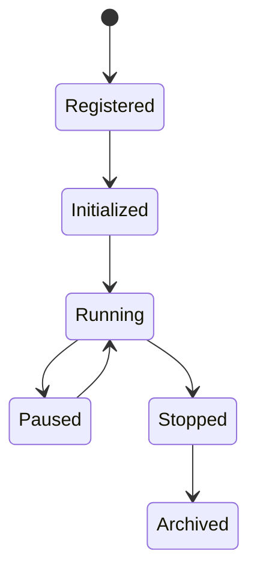

# SPEC-008 — Strategy SDK & Plugin Framework
Version: 1.0

## Executive Summary

The Strategy SDK defines the contract that every quantitative strategy must
implement. The objective is to allow researchers to develop, test, benchmark,
and deploy strategies without understanding the internal implementation of the
market data, execution, or infrastructure layers.

---

# 1. Design Goals

- Stable public SDK
- Strong typing
- Deterministic execution
- Pluggable architecture
- Testability
- Language consistency across all strategies

---

# 2. Strategy Lifecycle

Each transition must be logged with timestamps and metadata.

---

# 3. SDK Interface

Every strategy SHALL implement:

- initialize(config)
- validate(config)
- on_market_open()
- on_tick(tick)
- on_candle(candle)
- on_timer(timestamp)
- generate_signal()
- on_market_close()
- shutdown()

Optional hooks:

- on_order_update()
- on_position_update()
- on_error()

---

# 4. Strategy Manifest

Each strategy package contains:

strategy.yaml

Fields:

- id
- name
- author
- version
- description
- supported_assets
- supported_timeframes
- required_features
- parameters
- risk_profile
- tags

---

# 5. Inputs

Strategies may consume:

- Tick events
- Candle events
- Feature Store values
- Portfolio snapshot (read-only)
- Trading calendar
- Configuration

Strategies MUST NOT read databases directly.

---

# 6. Outputs

Allowed outputs:

- BUY
- SELL
- SHORT
- COVER
- HOLD

Each signal includes:

- confidence
- rationale
- timestamp
- symbol
- metadata

---

# 7. Plugin Loading

Discovery order:

1. Built-in strategies
2. Local plugins
3. Repository plugins (future)

Every plugin undergoes:

- Manifest validation
- Dependency validation
- Signature verification (future)
- Sandbox initialization

---

# 8. Versioning

Semantic Versioning:

MAJOR.MINOR.PATCH

Breaking interface changes require a new MAJOR version.

---

# 9. Security

Plugins may not:

- Access credentials
- Write to infrastructure services
- Execute shell commands
- Open arbitrary network connections

Future releases may isolate plugins in dedicated sandboxes.

---

# 10. Performance Targets

Strategy initialization:
<250 ms

Signal generation:
<10 ms per event

Memory:
Configurable budget per strategy instance.

---

# 11. Testing

Required:

- Unit tests
- Replay tests
- Determinism tests
- Performance benchmark
- Documentation examples

A strategy cannot be published unless all mandatory tests pass.

---

# 12. Acceptance Criteria

- Stable SDK interfaces
- Versioned manifests
- Deterministic outputs
- Plugin validation succeeds
- Complete developer documentation

---

# 13. Claude Code Guidance

Never bypass the SDK lifecycle.

New strategies must be implemented as plugins using documented interfaces.
Core services must not contain strategy-specific business logic.

Future specifications:
- SPEC-009: Institutional Backtesting Engine
- SPEC-010: Risk Management Engine
