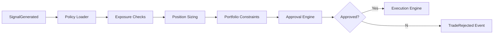

# SPEC-010 — Risk Management Engine
Version: 1.0

## Executive Summary

The Risk Management Engine is the mandatory approval layer between strategy
signals and order execution. No trade may reach a broker unless it has passed
all configured risk checks. The engine must be deterministic, explainable, and
fully auditable.

---

# 1. Objectives

- Protect capital
- Enforce trading policies
- Prevent invalid orders
- Produce explainable approvals/rejections
- Support configurable risk policies

---

# 2. Responsibilities

Owns:
- Position sizing
- Exposure limits
- Drawdown controls
- Daily loss limits
- Concentration checks
- Trade approval workflow

Never owns:
- Strategy generation
- Market data ingestion
- Order execution

---

# 3. Decision Pipeline

---

# 4. Risk Policies

## Position Risk
- Maximum position size
- Maximum leverage
- Instrument whitelist/blacklist

## Portfolio Risk
- Sector exposure
- Asset concentration
- Correlation thresholds

## Session Risk
- Daily loss limit
- Maximum open positions
- Maximum trades per day

---

# 5. Position Sizing

Supported methods:
- Fixed quantity
- Fixed capital
- Fixed fractional
- Kelly Criterion
- Volatility targeting (future)

All sizing calculations must be deterministic.

---

# 6. Risk Metrics

Per Position:
- Unrealized PnL
- Realized PnL
- Risk/Reward
- Stop distance

Portfolio:
- Gross exposure
- Net exposure
- Drawdown
- VaR
- CVaR
- Beta (future)

---

# 7. Domain Events

Consumes:
- SignalGenerated
- PositionUpdated
- OrderFilled

Produces:
- TradeApproved
- TradeRejected
- RiskLimitBreached

---

# 8. APIs

GET  /api/v1/risk/policies
PUT  /api/v1/risk/policies
POST /api/v1/risk/evaluate
GET  /api/v1/risk/report

---

# 9. Audit Requirements

Every decision records:
- Policy version
- Inputs
- Outputs
- Triggering signal
- Timestamp
- Correlation ID
- Explanation

Audit records are immutable.

---

# 10. Performance Targets

Risk evaluation:
<10 ms

Policy lookup:
<5 ms

Approval event publication:
<10 ms

---

# 11. Testing

Unit:
- Position sizing
- Drawdown
- VaR calculations
- Policy evaluation

Integration:
- End-to-end approval flow

Regression:
- Historical scenario replay

---

# 12. Acceptance Criteria

- No order bypasses the risk engine.
- Every rejection is explainable.
- Policies are versioned.
- Full audit trail exists.
- APIs and events documented.

---

# 13. Claude Code Guidance

The Risk Engine is the final authority before execution.
Implement all rules as composable policy modules.
Avoid hard-coded limits; every threshold must be configurable.
