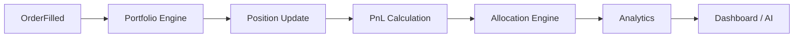

# SPEC-011 — Portfolio Construction & Optimization
Version: 1.0

## Executive Summary

The Portfolio Engine maintains the canonical state of all accounts, positions,
cash balances, and portfolio analytics. It is responsible for portfolio
construction, allocation, rebalancing decisions, and performance attribution.
It consumes approved executions and never generates trading signals itself.

---

# 1. Objectives

- Maintain an accurate portfolio state
- Track realized and unrealized PnL
- Support multiple allocation models
- Provide optimization recommendations
- Expose analytics to downstream services

---

# 2. Responsibilities

Owns:
- Accounts
- Portfolios
- Positions
- Cash balances
- Performance attribution
- Allocation models

Never owns:
- Strategy generation
- Market data ingestion
- Broker communication

---

# 3. High-Level Flow

---

# 4. Portfolio Model

Portfolio contains:

- Account ID
- Base currency
- Cash balance
- Buying power
- Open positions
- Closed positions
- Pending orders
- Daily PnL
- Lifetime PnL

Position contains:

- Symbol
- Quantity
- Average price
- Current price
- Market value
- Unrealized PnL
- Realized PnL

---

# 5. Allocation Models

Supported:

- Equal Weight
- Fixed Capital
- Risk Parity
- Minimum Variance (future)
- Black-Litterman (future)
- Kelly-based allocation

Every allocation must record the methodology used.

---

# 6. Portfolio Analytics

Metrics:

- Total Return
- Daily Return
- CAGR
- Volatility
- Sharpe Ratio
- Sortino Ratio
- Calmar Ratio
- Maximum Drawdown
- Turnover
- Concentration

---

# 7. Rebalancing

Triggers:

- Scheduled
- Threshold-based
- Risk event
- Manual request

Outputs:

- Recommended trades
- Allocation delta
- Estimated transaction costs

---

# 8. Domain Events

Consumes:
- OrderFilled
- MarketPriceUpdated
- TradeApproved

Produces:
- PositionUpdated
- PortfolioUpdated
- RebalanceSuggested

---

# 9. APIs

GET  /api/v1/portfolio
GET  /api/v1/portfolio/positions
GET  /api/v1/portfolio/analytics
POST /api/v1/portfolio/rebalance

---

# 10. Performance Targets

Position update:
<20 ms

Portfolio analytics refresh:
<100 ms

Dashboard response:
<150 ms

---

# 11. Testing

Unit:
- Position calculations
- PnL calculations
- Allocation algorithms

Integration:
- Order-to-portfolio flow

Regression:
- Historical portfolio replay

---

# 12. Acceptance Criteria

- Portfolio state always consistent
- PnL validated against benchmark datasets
- Rebalancing recommendations reproducible
- Analytics documented
- APIs versioned

---

# 13. Claude Code Guidance

Treat the Portfolio Engine as the single source of truth for holdings and PnL.
Never derive portfolio state independently in downstream services.
