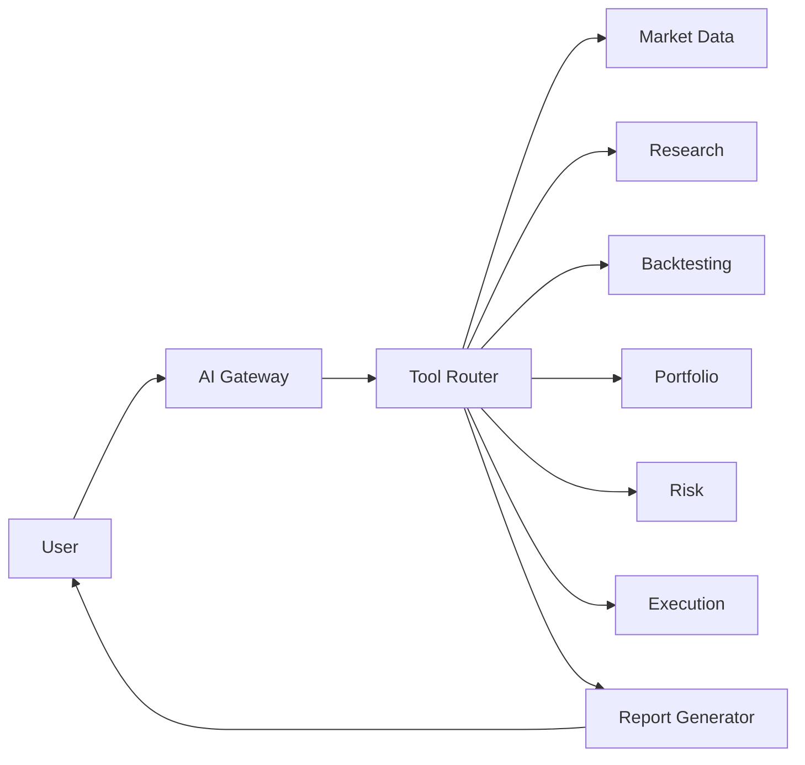

# SPEC-012 — AI Research Assistant
Version: 1.0

## Executive Summary

The AI Research Assistant is the intelligence layer of QuantForge AI. Rather than
making autonomous trading decisions, it assists researchers by explaining market
behavior, generating strategy ideas, reviewing experiments, summarizing results,
and interacting with every subsystem through documented APIs.

---

# 1. Objectives

- Natural-language interface for the platform
- Explain signals and portfolio behavior
- Generate research reports
- Assist with strategy development
- Summarize backtests
- Never bypass risk or execution controls

---

# 2. Responsibilities

Owns:
- Conversational interface
- Prompt orchestration
- Tool routing
- Report generation
- Explainability

Never owns:
- Direct order placement
- Risk approval
- Market data persistence

---

# 3. High-Level Architecture

---

# 4. Supported Capabilities

## Research
- Explain indicators
- Compare strategies
- Suggest new features
- Summarize experiments

## Portfolio
- Explain PnL
- Identify concentration risk
- Explain drawdowns

## Risk
- Explain rejected trades
- Summarize policy violations

## Code Generation
- Generate Strategy SDK templates
- Generate indicator skeletons
- Produce documentation

---

# 5. Tool Routing

Every request is classified into one or more domains:

- Market Data
- Research
- Strategy
- Backtesting
- Portfolio
- Risk
- Execution
- Documentation

The assistant invokes tools rather than directly accessing databases.

---

# 6. Explainability

Every recommendation includes:
- Evidence
- Confidence
- Source data
- Assumptions
- Limitations

The assistant must distinguish facts from hypotheses.

---

# 7. Conversation Memory

Stores:
- Session context
- User preferences
- Recent reports

Does not store:
- Secrets
- Broker credentials
- API keys

---

# 8. APIs

POST /api/v1/ai/chat
POST /api/v1/ai/report
POST /api/v1/ai/strategy-draft
GET  /api/v1/ai/history

---

# 9. Security

- Authenticated requests only
- Prompt injection filtering
- Tool permission checks
- Rate limiting
- Audit every tool invocation

---

# 10. Performance Targets

Interactive response:
<2 seconds (excluding model latency)

Tool execution:
<250 ms average

---

# 11. Testing

- Prompt regression tests
- Tool routing tests
- Hallucination guard tests
- Permission tests
- End-to-end workflow validation

---

# 12. Acceptance Criteria

- Explanations reference real platform data
- Tool routing is deterministic
- Reports are reproducible
- No unauthorized tool access
- Full audit trail

---

# 13. Claude Code Guidance

Implement the AI Assistant as an orchestration layer.
All business logic remains in domain services.
Every tool interface must be documented, typed, and independently testable.
