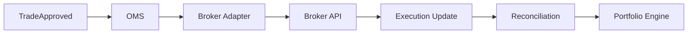

# SPEC-013 — Order Management System (OMS) & Broker Integration
Version: 1.0

## Executive Summary

The Order Management System (OMS) is responsible for translating approved
trading decisions into broker-compatible orders, tracking their lifecycle,
reconciling executions, and maintaining a complete audit trail. It is the only
component permitted to communicate with external broker APIs.

---

# 1. Objectives

- Centralize order lifecycle management
- Abstract broker-specific APIs
- Ensure reliable execution and reconciliation
- Maintain immutable execution history
- Support paper and live trading modes

---

# 2. Responsibilities

Owns:
- Order lifecycle
- Broker adapters
- Execution reconciliation
- Retry policies
- Order audit trail

Never owns:
- Strategy generation
- Risk evaluation
- Portfolio calculations

---

# 3. High-Level Architecture

---

# 4. Order Lifecycle

States:

- Created
- Validated
- Submitted
- Acknowledged
- Partially Filled
- Filled
- Cancelled
- Rejected
- Expired

Every transition generates an immutable event.

---

# 5. Supported Order Types

- Market
- Limit
- Stop
- Stop-Limit

Future:
- Iceberg
- TWAP
- VWAP
- Bracket Orders

---

# 6. Broker Adapter Layer

Supported adapters (initial targets):

- Zerodha Kite
- Angel One SmartAPI
- Shoonya

Responsibilities:
- Authentication
- Request translation
- Response normalization
- Rate-limit handling
- Retry logic

---

# 7. Reconciliation

Execution updates are matched against:

- Client order ID
- Broker order ID
- Symbol
- Quantity
- Timestamp

Any mismatch raises a reconciliation alert.

---

# 8. Domain Events

Consumes:
- TradeApproved
- CancelOrderRequested

Produces:
- OrderSubmitted
- OrderAcknowledged
- OrderFilled
- OrderRejected
- OrderCancelled

---

# 9. APIs

POST /api/v1/orders
DELETE /api/v1/orders/{id}
GET /api/v1/orders
GET /api/v1/orders/{id}
GET /api/v1/orders/history

---

# 10. Reliability

- Idempotent order submission
- Automatic retry with exponential backoff
- Duplicate suppression
- Circuit breaker for broker outages
- Fail-safe paper trading fallback

---

# 11. Security

- Broker credentials encrypted
- Least-privilege access
- Signed requests where supported
- Full audit logging

---

# 12. Performance Targets

Order submission:
<100 ms (excluding broker latency)

Execution reconciliation:
<50 ms

Order status propagation:
<100 ms

---

# 13. Testing

Unit:
- Adapter translation
- State transitions

Integration:
- Paper broker
- Mock broker APIs

Chaos:
- Broker outage
- Duplicate callbacks
- Delayed fills

---

# 14. Acceptance Criteria

- All orders tracked through lifecycle
- Broker abstraction validated
- Reconciliation deterministic
- APIs documented
- Full audit trail

---

# 15. Claude Code Guidance

The OMS is the exclusive gateway to broker APIs.
All broker-specific logic must reside within adapter modules.
Core services interact only through the OMS interfaces.
