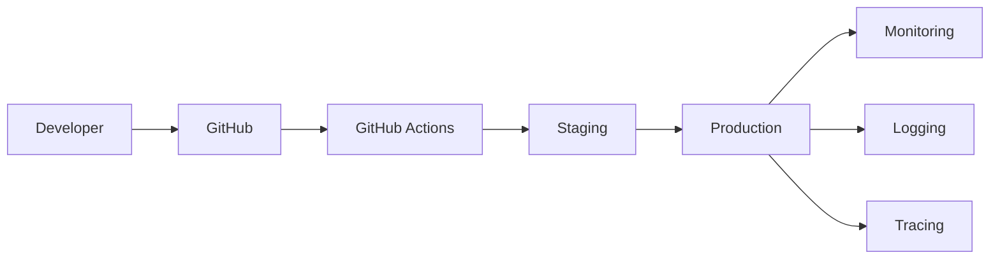

# SPEC-015 — Infrastructure, Deployment & Observability
Version: 1.0

## Executive Summary

This specification defines the operational architecture for QuantForge AI. It
covers local development, deployment environments, CI/CD, observability,
security, disaster recovery, and scalability. The objective is to ensure that
every service can be developed, tested, deployed, monitored, and recovered
reliably while remaining cost-effective during development.

---

# 1. Objectives

- Local-first developer experience
- Reproducible environments
- Automated CI/CD
- End-to-end observability
- Secure secret management
- Scalable service deployment
- Free-tier friendly development

---

# 2. Environment Strategy

## Local
- Docker Compose
- PostgreSQL
- Redis
- FastAPI
- Next.js
- Mock Broker

## Staging
- Same topology as production
- Test broker integrations
- Synthetic market data

## Production
- Containerized services
- Managed database
- Managed Redis
- Reverse proxy
- Horizontal scaling

---

# 3. Monorepo Layout

apps/
- web
- api

services/
- market-data
- research
- strategy
- risk
- portfolio
- execution
- ai

packages/
- sdk
- shared
- ui

infra/
- docker
- scripts
- ci

docs/
- engineering specs
- ADRs
- API references

---

# 4. Deployment Topology

---

# 5. CI/CD Pipeline

Stages:

1. Lint
2. Type Check
3. Unit Tests
4. Integration Tests
5. Build
6. Security Scan
7. Deploy Preview
8. Staging Approval
9. Production Release

Deployment is blocked if any mandatory stage fails.

---

# 6. Secrets Management

Requirements:

- Environment variables only
- No secrets in source control
- Secret rotation supported
- Separate credentials per environment

---

# 7. Observability

Logging:
- Structured JSON
- Correlation IDs
- Request IDs

Metrics:
- Request latency
- Tick throughput
- Signal generation latency
- Order throughput
- Error rate

Tracing:
- Distributed tracing across services

Health Endpoints:
- /health
- /ready
- /live

---

# 8. Disaster Recovery

Backups:
- Daily logical backup
- Weekly snapshot
- Monthly archive

Recovery:
- Restore drills
- Recovery verification
- Documented runbooks

---

# 9. Security

- TLS everywhere
- JWT authentication
- Principle of least privilege
- Dependency scanning
- Audit logging
- Immutable deployment artifacts

---

# 10. Performance Targets

API availability:
99%

Dashboard update latency:
<100 ms

Deployment rollback:
<10 minutes

---

# 11. Testing

- Infrastructure smoke tests
- Deployment verification
- Backup restore tests
- Load testing
- Chaos testing

---

# 12. Acceptance Criteria

- Reproducible environments
- Automated deployments
- Centralized logging
- Metrics dashboard
- Successful backup restore
- Security scanning enabled

---

# 13. Claude Code Guidance

Infrastructure changes must be version-controlled.
Treat infrastructure as code.
Never merge changes that bypass CI/CD or reduce observability.
